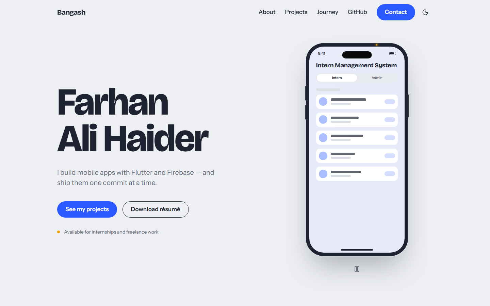

# Farhan Ali Haider — Portfolio

The personal portfolio of Farhan Ali Haider ("Bangash"), a mobile app developer working with Flutter and Firebase.

**Live site: https://farhan-bangash.vercel.app**



## Features

- **A phone as the storyteller.** A pure-CSS device that powers on when the page loads, then cycles through app screens (pause button, pauses on hover, focus and hidden tabs).
- **Project case studies.** On desktop the phone stays pinned while the projects scroll and switches to the project in view; on smaller screens each project has its own phone.
- **Git-log style journey** with dots that fill in as you scroll.
- **Live GitHub section** with repo and follower counts, top languages and recent repos, cached for the session, with a clean fallback if the API is down.
- **Contact form** delivered to your inbox through Web3Forms, with validation, a spam honeypot and clear sending, success and error states.
- **Light and dark themes** that follow the system setting and remember your choice.
- **Accessible and calm.** Skip link, visible focus everywhere, full keyboard use, screen-reader labels, and every animation respects `prefers-reduced-motion`.
- **Fast.** Prerendered HTML, a small initial bundle, no layout shift, and a Lighthouse mobile score of at least 90 in all four categories.
- **SEO and sharing.** Open Graph and Twitter preview image, JSON-LD, sitemap and robots.txt, plus an on-brand 404 page.

## Tech stack

- Vite
- React 19 + TypeScript
- Tailwind CSS v4
- GSAP + ScrollTrigger, Lenis
- lucide-react icons
- Web3Forms (contact form)
- GitHub REST API (live activity)
- Vercel (hosting and Web Analytics)

Everything uses free tiers. Design, requirements and the build history are in [`docs/`](docs/).

## Local setup

You need Node.js 20.19+ or 22.12+ (required by Vite 8).

```bash
npm install
```

```bash
npm run dev
```

Then open http://localhost:5173.

| Script                 | What it does                                                                   |
| ---------------------- | ------------------------------------------------------------------------------ |
| `npm run dev`          | Development server with hot reload                                             |
| `npm run build`        | Type-check, build, and prerender the home page into `dist/`                    |
| `npm run preview`      | Serve the production build locally                                             |
| `npm run lint`         | ESLint                                                                         |
| `npm run format`       | Format everything with Prettier                                                |
| `npm run format:check` | Check formatting without changing files                                        |
| `npm run images`       | Regenerate the share image, touch icon and phone shadow (needs Chrome or Edge) |

After a fresh clone, enable the commit hook once with `git config core.hooksPath .githooks`.

## Editing content

All personal content lives in one file: [`src/data/content.ts`](src/data/content.ts). Components never contain personal text, so you only edit that file and push.

- Values that start with `TODO:` are placeholders. Placeholder text shows as written, so it is easy to spot; placeholder links (email, LinkedIn) are hidden until you fill them in.
- Every placeholder has a `// TODO(bangash):` comment above it.

### Adding a project

Add an object to the `projects` array in `src/data/content.ts`. Projects appear in the order of the array:

```ts
{
  slug: 'my-new-app', // used for screenshot folders and ids
  name: 'My New App',
  summary: 'One line about what it is.',
  problem: 'What problem it solves, and for whom.',
  built: 'What you built and how.',
  role: 'Solo developer',
  stack: ['Flutter', 'Firebase Auth'],
  status: 'in-progress', // 'live' | 'completed' | 'in-progress' | 'planned'
  links: { github: 'https://github.com/bangash40/my-new-app' }, // demo is optional
  screens: [{ kind: 'image', src: '/screens/my-new-app/1.webp', alt: 'What the screen shows' }],
  tint: '#2b59ff', // accent for placeholder screens
},
```

The phone, pinned layout and progress indicator pick it up automatically. If you have no screenshots yet, use a placeholder screen with one of the existing variants (`ims`, `kheench`, `miniplayer`, `portfolio`). A new variant needs a small addition to `src/components/phone/PlaceholderScreen.tsx`.

### Adding app screenshots

Until real screenshots exist, each project shows a designed placeholder screen. To show a real one:

1. Take a screenshot of the app and export it as **WebP at 1080 × 2340** (a free converter such as [Squoosh](https://squoosh.app) works).
2. Save it as `public/screens/<project-slug>/1.webp`, then `2.webp` and so on (up to 4 per project). The slug is the project's `slug` in `src/data/content.ts`, for example `kheench`.
3. In `src/data/content.ts`, replace that project's placeholder in `screens` with image entries:

   ```ts
   screens: [
     { kind: 'image', src: '/screens/kheench/1.webp', alt: 'Kheench home screen with a pasted video link' },
     { kind: 'image', src: '/screens/kheench/2.webp', alt: 'Kheench quality picker showing 1080p and 720p' },
   ],
   ```

   Write `alt` text that says what the screen shows. The phone's screen-reader label uses it.

The first hero screen loads with high priority; every other screenshot is lazy-loaded.

### Replacing the résumé

Save your PDF as `public/resume/Farhan-Ali-Haider-Resume.pdf` (exactly that name) and push. Both "Download résumé" buttons already point there. To use another file name, change `resumeUrl` in `src/data/content.ts`.

### Adding a photo

Save a WebP at `public/images/avatar.webp`, then set `avatar: '/images/avatar.webp'` under `person` in `src/data/content.ts`. It appears in the About section; nothing renders while it is unset.

## Contact form setup

The contact form sends messages to your inbox through [Web3Forms](https://web3forms.com) (free tier, no backend needed).

1. Go to web3forms.com, enter the email address that should receive messages, and copy the access key they email you. The key is designed to be public.
2. **Local development:** create a `.env` file in the project root (it is git-ignored) with:

   ```bash
   VITE_WEB3FORMS_KEY=your-access-key
   ```

   Restart `npm run dev` after changing it.

3. **Vercel:** Project → Settings → Environment Variables → add `VITE_WEB3FORMS_KEY` with the same value for all environments, then redeploy (Deployments → ⋯ → Redeploy). Vite bakes the key in at build time, so a redeploy is required.
4. Send yourself a test message from the live site and check your inbox (and spam) for "New message from portfolio".

Without a key the form is replaced by a short note pointing visitors to your email (or GitHub, if no email is set in `src/data/content.ts`). To rotate the key, generate a new one on Web3Forms and repeat steps 2–3.

## Deployment

- Hosted on **Vercel Hobby** (free). Every push to `main` builds and deploys to production automatically.
- Vercel runs `npm run build`, which also prerenders the home page into `dist/index.html`, and serves `dist/`.
- `vercel.json` enables clean URLs and sends unknown paths to the app, which shows the 404 page.
- Environment variable: `VITE_WEB3FORMS_KEY` (see above). Web Analytics is enabled in the project's Analytics tab.
- If you add a custom domain later, update the site URL in `index.html` (canonical, Open Graph and JSON-LD), `public/robots.txt`, `public/sitemap.xml`, `scripts/og-image.html` and `site.url` in `src/data/content.ts`, then run `npm run images`.

## Still to do (owner)

Everything below lives in `src/data/content.ts` (search for `TODO(bangash)`) or `public/`:

- [ ] Résumé PDF at `public/resume/Farhan-Ali-Haider-Resume.pdf` (the buttons return a 404 until then)
- [ ] Real bio, 2–3 short paragraphs
- [ ] Email address (shows the email link and is used in the contact form's error message)
- [ ] LinkedIn URL
- [ ] WhatsApp link (optional)
- [ ] Confirm the availability line
- [ ] Adjust the skills list
- [ ] For each project: the problem it solves, your role, and its status
- [ ] GitHub links for the Intern Management System, Kheench and the mini player (if public)
- [ ] Real app screenshots (see above)
- [ ] Journey: real dates, education details, and confirm each entry and its order
- [ ] Photo (optional)

Make each replacement its own small commit, for example `chore(content): add real bio`.

## Commit rules

- One build-plan step = one commit = one push (see `docs/BUILD_PLAN.md`).
- Conventional Commits in lowercase, imperative mood, no trailing period: `type(scope): short description`.
- The repository owner is the only author. No `Co-Authored-By`, AI attribution or session trailers.
- The `commit-msg` hook in `.githooks/` strips attribution trailers. Enable it once per clone with `git config core.hooksPath .githooks`, and never commit with `--no-verify`.
- Run `npm run build` (and `npm run lint`) before every commit. Never commit a broken build.
